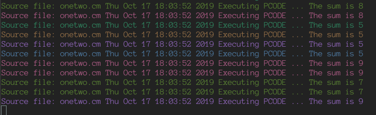

# BRUTE-BACI
Little script that will compile your .cm and run the pco all in one  
Now with deadlock detection! Script will terminate outputting DEADLOCK DETECTED if program deadlocks  
Note: Program should not output any string containing "Halt at" otherwise it breaks things 
## How To?
Move the brute-baci.sh to /usr/local/bin unless you wanna have a bad time 
You might have to run chmod +x on it, I dunno, I had to. 
Make sure your "bacc" and "bainterp" are also in /usr/local/bin 
## Usage
the command is as follows (no quotes): "brute-baci.sh sample.cm" 
so to compile and run onetwo.cm it would be "brute-baci.sh onetwo.cm"  
NOTE: Brute-Baci does not preserve newlines or tabs and at the speed it runs, for larger problems with more complex output, it will be difficult to determine the correctness of the output, Brute-Baci is more a tool to brute force check if your program will deadlock
## Sample Output:

